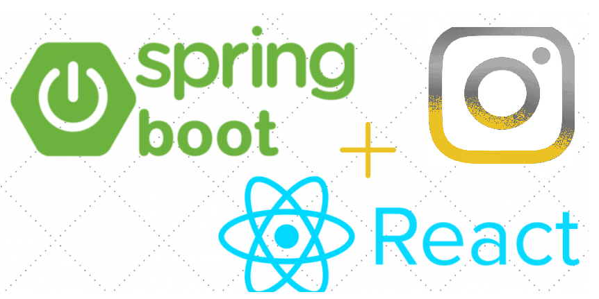
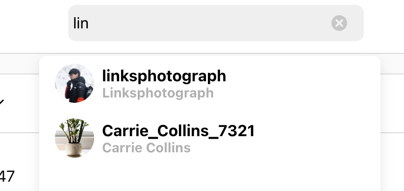
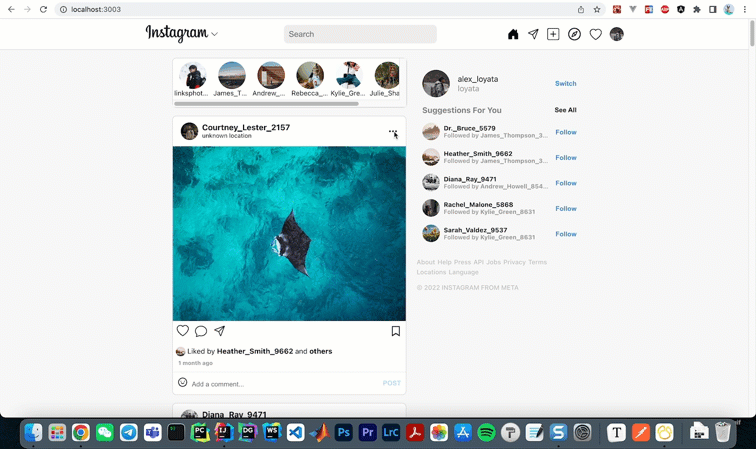
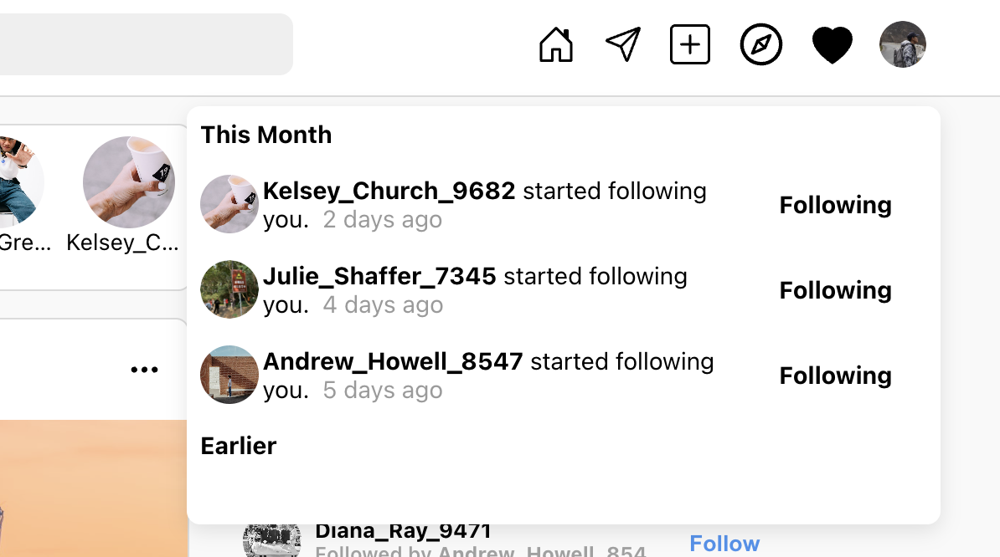
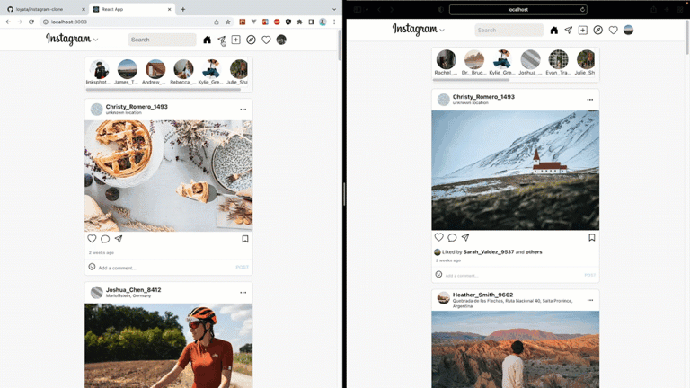

# Instagram Clone



A full-stack Instagram-inspired web application built with React and Spring Boot. The project recreates the core social media experience: authentication, profile pages, post creation, image upload, feeds, search, comments, likes, saves, follows, and chat.

This repository is intended for learning, portfolio work, and full-stack practice. Instagram branding, names, and visual references belong to their respective owners.

## Features

- User sign up and login with JWT-based authentication
- Username and email availability validation
- Personalized home feed with posts, profile information, and recommendations
- User search with profile navigation
- Post creation with image cropping, resizing, filters, captions, alt text, and location suggestions
- AWS S3 image upload support for posts and avatars
- Explore page with a quilted image layout
- Like, save, comment, copy link, follow, and unfollow actions on posts
- Personal profile pages with posts, saved posts, followers, and following counts
- Recent activity reports for new followers
- Chat sessions with user search and message history

## Preview

### Login and Sign Up


### Home Feed


### Search



### Create a Post


### Explore


### Post Actions



### Profile


### Activity and Chat





## Tech Stack

### Frontend

- React 18
- Redux Toolkit
- React Router
- Axios
- Material UI
- React Icons
- HTML-to-image
- AWS SDK for S3 uploads

### Backend

- Java 17
- Spring Boot 2.7
- MyBatis
- MySQL
- Apache Shiro
- JWT
- Maven

## Project Structure

```text
.
├── backend/                 # Spring Boot API and MyBatis data layer
│   ├── src/main/java/       # Controllers, models, mappers, services, utilities
│   ├── src/main/resources/  # Application config and database schema
│   └── pom.xml
├── frontend/                # React application
│   ├── public/
│   ├── src/
│   └── package.json
├── images/                  # README screenshots and GIF previews
└── README.md
```

## Getting Started

### Prerequisites

- Node.js and npm
- Java 17
- Maven
- MySQL
- AWS S3 bucket for image uploads
- Mapbox access token for location search

## Backend Setup

1. Open the backend folder:

   ```bash
   cd backend
   ```

2. Create a MySQL database:

   ```sql
   CREATE DATABASE instagramDB;
   ```

3. Update the database settings in `backend/src/main/resources/application.properties` if your local MySQL configuration is different:

   ```properties
   server.port=8080
   spring.datasource.username=root
   spring.datasource.password=your_mysql_password
   spring.datasource.url=jdbc:mysql://localhost:3306/instagramDB?serverTimezone=UTC&createDatabaseIfNotExist=true&allowPublicKeyRetrieval=true&useSSL=false
   ```

4. Start the Spring Boot server:

   ```bash
   mvn spring-boot:run
   ```

The backend runs on `http://localhost:8080` by default.

## Frontend Setup

1. Open the frontend folder:

   ```bash
   cd frontend
   ```

2. Install dependencies:

   ```bash
   npm install
   ```

3. Create a `.env` file in the `frontend` folder. You can start from `frontend/.env.example`:

   ```env
   GENERATE_SOURCEMAP=false
   DISABLE_ESLINT_PLUGIN=true
   REACT_APP_baseURL=http://localhost:8080
   REACT_APP_geoAPIToken=your_mapbox_token
   REACT_APP_S3_BUCKET=your_s3_bucket_name
   REACT_APP_REGION=your_aws_region
   REACT_APP_ACCESS_KEY=your_aws_access_key
   REACT_APP_SECRET_ACCESS_KEY=your_aws_secret_key
   ```

4. Start the React app:

   ```bash
   npm start
   ```

The frontend runs on `http://localhost:3000` by default.

## Useful Commands

### Backend

```bash
cd backend
mvn spring-boot:run
mvn test
```

### Frontend

```bash
cd frontend
npm start
npm run build
npm test
```

## Notes

- Do not commit real `.env` files or production credentials.
- The app expects the backend API URL to be available through `REACT_APP_baseURL`.
- S3 and Mapbox features require valid credentials configured locally.
- The database schema is available in `backend/src/main/resources/schema.sql`.

## License

This project is for educational use. Please review and adapt it responsibly before using it in production.
